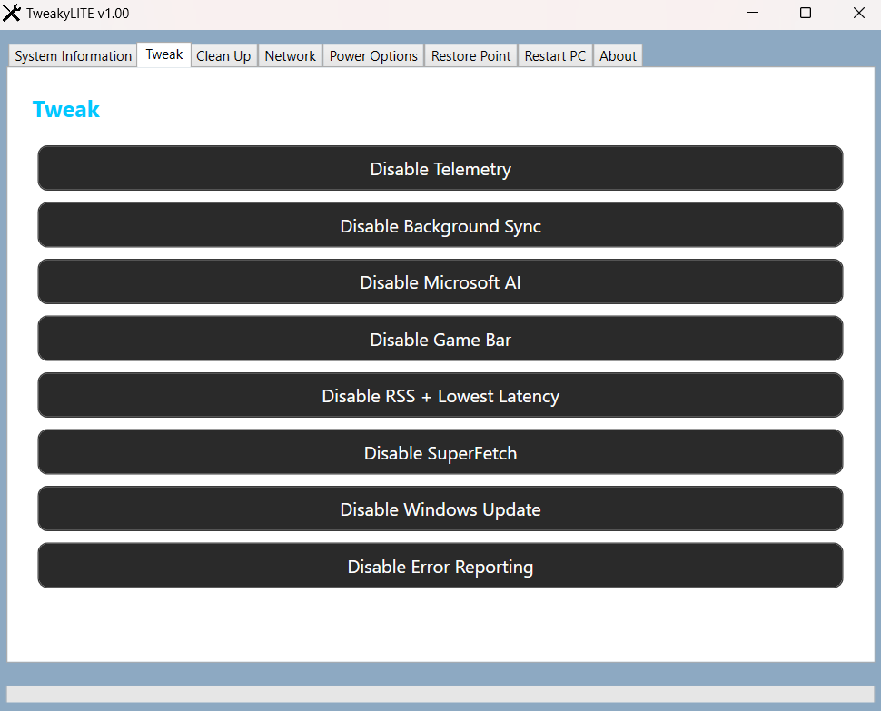

# 🛠️ TweakyLITE

> Lightweight Windows Optimization Toolkit built with PowerShell + WPF  
> Clean • Fast • Minimal • No Bloat

---

## ✨ Overview

TweakyLITE is a lightweight Windows tweaking tool designed to:

- Improve performance
- Reduce background services
- Optimize network settings
- Clean temporary files
- Manage power profiles

Built using **PowerShell + WPF GUI** for a modern and responsive interface.

---

## 🔥 Features

### 🖥 System Information
- Windows version detection
- Secure Boot status
- TPM detection

### ⚙️ Performance Tweaks
- Disable Telemetry
- Disable Game Bar
- Disable Superfetch
- Disable Windows Update
- Disable Error Reporting

### 🧹 Clean Up
- Remove temporary files
- Disable Reserved Storage
- Remove NVIDIA telemetry (optional)

### 🌐 Network Tools
- Custom DNS (Primary + Secondary)
- DNS Detection
- Flush DNS
- Quick access to Network Connections

### ⚡ Power Management
- Switch to Performance profile
- Switch to Balanced profile

### 🔄 System Tools
- Open Restore Point
- One-click Restart

---

## 🖼️ Interface Preview

